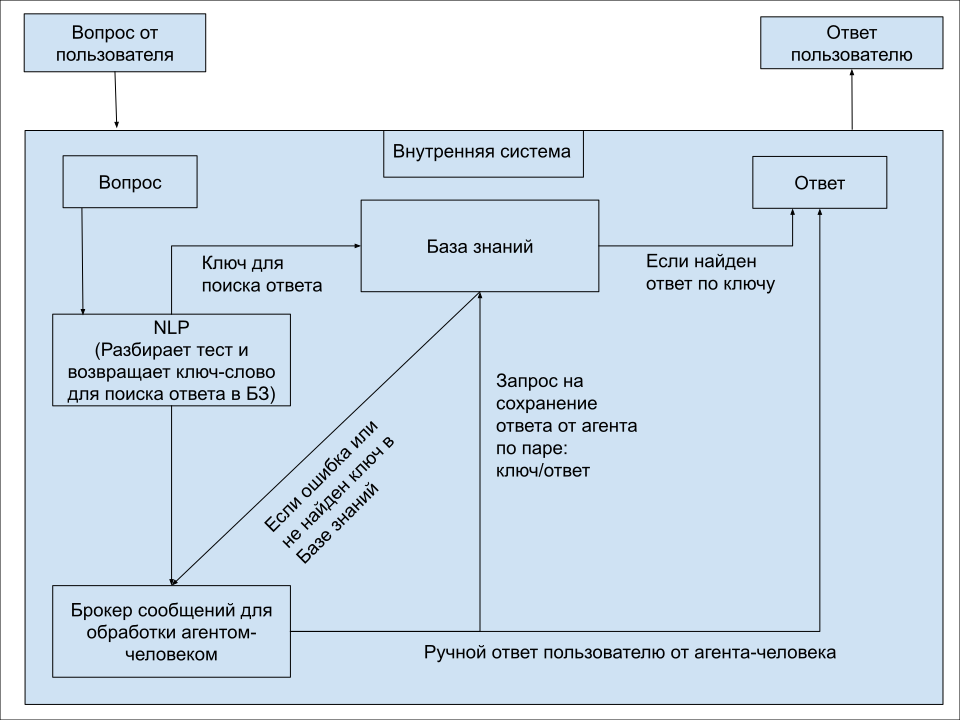

# TzTrood

Интеллектуальный сервер на Go с маршрутизацией на основе интентов, Redis-кешированием и fallback на человеческого агента.

## 🛠 Стек технологий

- **Go** — основной язык разработки
- **Gin** — HTTP-фреймворк
- **Redis** — хранилище интентов и ответов
- **NLP-сервис** — сторонний микросервис для анализа интента
- **Logrus** — логирование

## 📁 Структура проекта

```
TzTrood/
├── cmd/
│   └── main.go                    # Точка входа
├── internal/
│   └── server/
│       ├── config/               # Конфигурация (mock)
│       │   └── config.go
│       ├── repository/
│       │   ├── interface.go      # Интерфейс хранилища
│       │   ├── nlp/              # Работа с NLP-сервисом
│       │   │   └── httpNLP.go
│       │   └── redisdb/          # Работа с Redis
│       │       └── start.go
```

## 🚀 Запуск

1. Убедитесь, что у вас запущены Redis, NLP-сервис и сервис человек-агент.

2. Запустите сервер:

```bash
go run ./cmd/main.go
```

Сервер поднимется на порту `:8080`.

## 📡 API

### `POST /message`

Запрос:
```json
{
   "text": "как получить справку?"
}
```

Ответ:
```json
{
   "response": "Вы можете получить справку в разделе Помощь."
}
```

## 🔄 Поведение сервера

1. Получает JSON-запрос от пользователя.
2. Отправляет текст в NLP-сервис для определения интента.
3. Ищет готовый ответ в Redis:
   - Если найден — отправляет его пользователю.
   - Если нет — пересылает запрос на сервис человек-агент и кеширует полученный ответ в Redis.



## 📌 Конфигурация

Все параметры задаются в `config.NewMock()`:

```go
HttpPort:          ":8080",
ServiceHumanAgent: "http://localhost:9000/human",
NLPAddress:        "http://localhost:8000/analyze",
Redis:             { Addr: "localhost:6379", DB: 0 },
```

## 🧪 Пример запроса через curl

```bash
curl -X POST http://localhost:8080/message \
  -H "Content-Type: application/json" \
  -d '{"text": "как сменить пароль?"}'
```